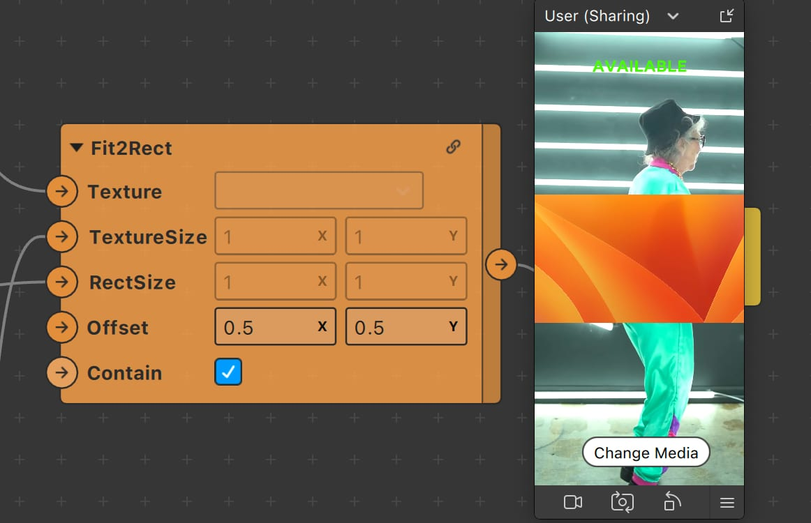
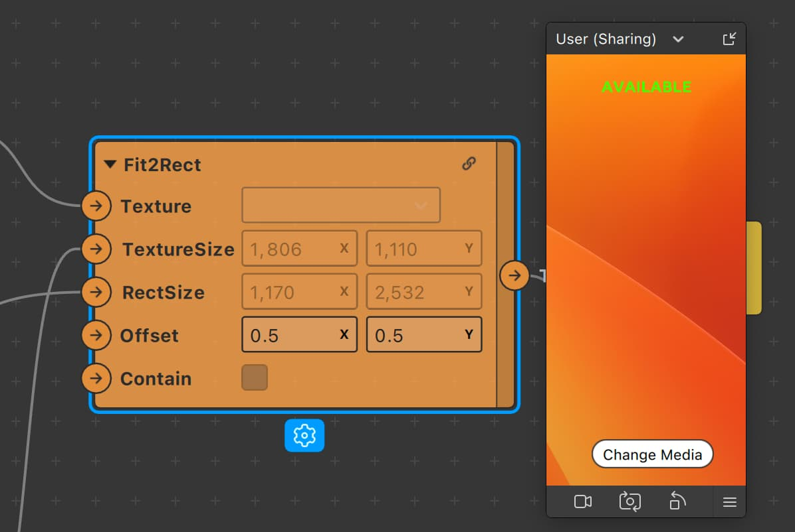

# Meta Spark Gallery Texture

This project was originally made to reproduce some buggy / unexpected behavior with the gallery texture states, but it can also be used as a template for any projects that need to use the feature. It shows how to get the size of the media and resize it to fit the screen space. 

By default, it will contain the image in the screen space so you can see the whole thing. 

If you want to cover the whole screen with the gallery texture, uncheck "contain" on the fit2rect patch, and it will use the "cover" behavior.

